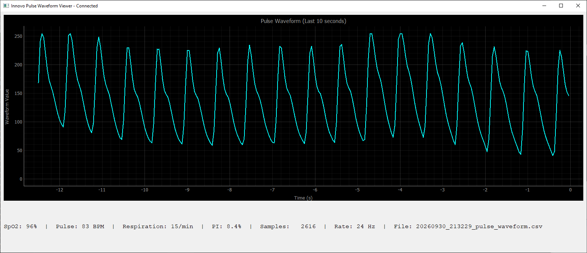
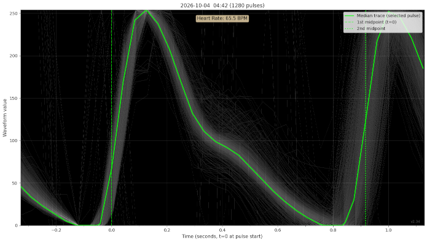

The **innovo_pi_logger.py** connects to an INNOVO iP900BP-B "finger pulse oximeter" over Bluetooth (BLE protocol = Bluetooth Low Energy) and records the data stream it generates. It was tested on a Raspberry Pi 3, and should work on 
any other machine that has Bluetooth capability and the python libraries.

It records SpO2, Pulse, Respiration Rate, and Perfusion Index (PI%) once per second to a CSV file.
I found the reported respiration rate (estimated from HR timing variation) to be unreliable, by comparison to more direct methods like a respiratory belt. Extracting that rate is sensitive to even small motion artifacts.
Assuming there is little or no hand or arm motion, the SpO2 and Pulse values seem reasonable. The Bluetooth data also includes the raw plethysmograph signal, 
although it's only 8 bit resolution at 24 samples per second. The logger records this in a separate CSV file.
I'm not sure how accurate the pleth signal is, but it looks plausible and sometimes even shows a little bump that seems 
to be the dicrotic notch signal from the aortic valve closure.

Below output is from a Windows laptop running **pulse_waveform_viewer.py**


Below text is from a headless Pi logging the data. You can also run this program with the **--rssi** option 
to just show and log the signal strength of the device without actually connecting and getting the SpO2, pulse etc. data. It will record the current and minimum-observed signal so you can walk around your house to see how far away you can get and still get reception. In my case, it still works two rooms away.
```
pi@rp4:~/Documents/sleep $ ./innovo_pi_logger.py
================================================================================
Innovo iP900BP-B BLE Logger (Raspberry Pi) v2.4
================================================================================
Scanning for Innovo devices...
Found iP900BPB at ED:9B:47:2E:0F:68 (RSSI: -65 dBm)
Connecting to ED:9B:47:2E:0F:68...
Summary CSV initialized: /home/pi/20260930_230330_pulse.csv
Waveform CSV initialized: /home/pi/20260930_230330_pulse_waveform.csv
Connected!
================================================================================
Live Measurements (put finger on oximeter, press Ctrl+C to stop)
================================================================================
[  28] SpO2:  97% | Pulse:  72 BPM | Respiration:  9/min | PI:  8.0% | Bad:   3     ^C
Stopping...
Logged 28 summary measurements to /home/pi/20260930_230330_pulse.csv
Bad frames (all zeros): 3
Logged 684 waveform samples to /home/pi/20260930_230330_pulse_waveform.csv
```
These programs search for a device named "iP900BPB" and if multiple exist, uses the one with the best signal strength.
Note: this is unofficial code and I have no connection with Innovo, other than having bought a few of these devices.

Below image generated by **pulse_storagescope.py -chunk 20** which stacks up pulses in 20 minute chunks.

